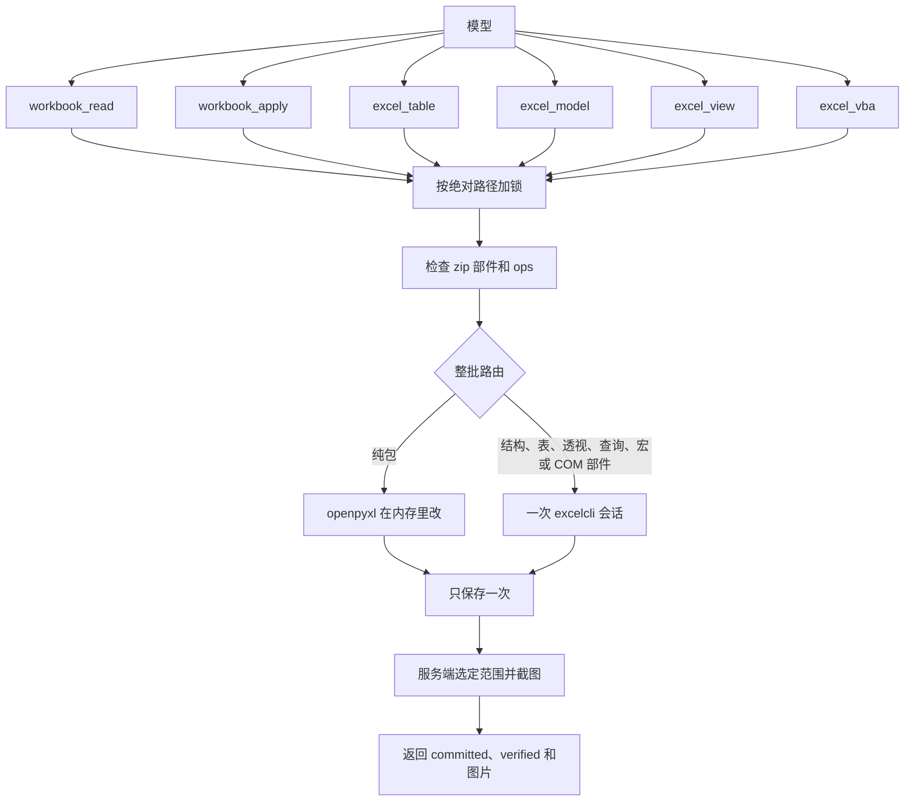
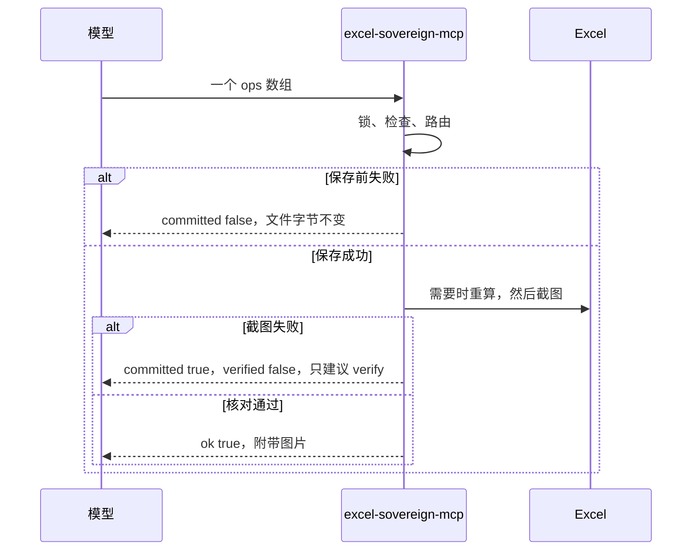

# excel-sovereign-mcp

本地 Excel MCP。模型只提交工作和路径，服务端决定用文件包还是真正的 Excel，保存一次，并在返回前截图。

Windows · Python 3.11+ · 需要本机 Microsoft Excel 做重算和截图 · [MIT](LICENSE)

纯包写入可以不经过 Excel 完成修改。只要这次调用要重算、改结构、碰到透视或查询，或者要截图核对，就会打开 Excel。它不是云服务，工作簿不出本机。

## 安装

```powershell
git clone https://github.com/limoaCatherine/excel-sovereign-mcp.git
cd excel-sovereign-mcp
python -m pip install -e .
dotnet build vendor\mcp-server-excel\src\ExcelMcp.CLI\ExcelMcp.CLI.csproj -c Release
```

`dotnet build` 需要 .NET 10 SDK。编出的 `excelcli.exe` 留在本机构建目录，不进版本库。已经编过也可以用环境变量 `EXCELCLI` 指向它。

Cursor 里这样注册：

```json
{
  "mcpServers": {
    "excel-sovereign": {
      "command": "excel-sovereign-mcp"
    }
  }
}
```

调用前先在 Excel 里保存并关闭同一个文件。公式用英文函数名。数字格式用 Excel 格式码。

## 架构

六个入口，一条写入管道。模型不传 `engine`，也不持有 `session_id`。入口只决定这批 `ops` 属于哪一组动作，不决定用文件包还是 Excel。



各入口使用同一份 `ops` 形状。一批里只要有一步需要 Excel，整批都走 COM。表、查询、数据模型和 VBA 分开发送，避免每次对话带上全部参数。



`verify` 是一个操作，不是第四个工具。它只重新打开、重算和截图，不会把插入或删除再做一遍。

## 六个入口

| 工具 | 作用 |
|---|---|
| `workbook_read` | 读值、公式和缓存。默认 4000 格，用 `nextRange` 继续。拿同一把锁，不截图。 |
| `workbook_apply` | 值、公式、名称、排版、`layout`、工作表结构。服务端保存并截图。 |
| `excel_table` | 表、透视表、图表、切片器。 |
| `excel_model` | Power Query、数据模型、DAX。 |
| `excel_view` | 条件格式、数据验证、批注、超链接、冻结、隐藏工作表。 |
| `excel_vba` | 列出、查看、导入、更新、运行、删除 VBA。只有这一次调用放开宏。 |

动作名写在对应工具的说明里。每个 op 只带自己用到的字段，不把全部命令参数放进工具 schema。送错入口会返回 `wrong_tool`。

单次写入超过 10 万格返回 `too_large`，不截断保存。只接受 `.xlsx` 和 `.xlsm`。`.xls`、`.xlsb`、加密和 IRM 在改动前拒绝。

## 和别的 Excel MCP 比

下面只写各自仓库里能对上的事实，不把没测过的速度排成名次。

| | excel-sovereign-mcp | [haris-musa/excel-mcp-server](https://github.com/haris-musa/excel-mcp-server) | [sbroenne/mcp-server-excel](https://github.com/sbroenne/mcp-server-excel) | [negokaz/excel-mcp-server](https://github.com/negokaz/excel-mcp-server) | [knorq-ai/xlsx-mcp-server](https://github.com/knorq-ai/xlsx-mcp-server) |
|---|---|---|---|---|---|
| 运行方式 | 本机 stdio | 本机，也可 HTTP | 本机 Windows | 本机 | 本机 |
| Excel 程序 | 重算、结构和截图需要 | 不需要 | 每次都需要 | 实时编辑和截图需要 | 不需要 |
| 工具面 | 6 个入口，一套 `ops` | 按操作拆开 | 31 个工具 | 读、写、截图分开 | 37 个工具 |
| 谁选引擎 | 服务端 | 文件库 | COM | Windows 上走 Excel | 文件库 |
| 改表名 | Excel 改名，跨表引用跟着走 | 只改 `sheet.title` | Excel 改名 | 未列为这项能力 | 插入不平移已有公式引用 |
| 重算 | 工作簿里有公式才 `Calculate` | 读已有缓存 | Excel 计算 | 未列为独立能力 | 明确不重算 |
| 写完截图 | 每次写入都做，范围由服务端算 | 无 | 模型另调截图 | 模型另调 `excel_screen_capture` | 无 |
| 透视表 | Excel 透视缓存 | `pivot.py` 用普通表做汇总 | Excel 透视 | 工具列表里没有 | 明确不能创建 |
| 宏 | 只有含 VBA 操作的那次调用放开 | 无 | 有 | 无 | 不支持 `.xlsm` |
| 会话 | 服务端持有，调用之间关掉工作簿 | 无 | 调用方或守护进程持有 | 无 | 无 |

haris 的改名行为见其 `src/excel_mcp/sheet.py`。透视实现见其 `src/excel_mcp/pivot.py`，那里创建的是 `openpyxl` 的 `Table`。knorq 的限制写在它自己的 README 里。sbroenne 的 31 个工具和 COM 路径写在它的 README 里。negokaz 的分页默认 4000 格，截图是单独工具。

## 耗时出在哪里

截图要打开 Excel，所以纯包修改也不会变成一次纯内存返回。

本机各观测一次，时间含截图：

| 操作 | 引擎 | 耗时 | 结果 |
|---|---|---|---|
| 只改一个字色 | openpyxl | 7.72 秒 | 已保存，`calc` 为 `skipped` |
| 重命名工作表 | COM | 8.83 秒 | 截图被裁切，`verified` 为 false |

这是一台 Windows 机器上的单次观测，用来说明时间主要花在启动 Excel 和截图，不是四个项目的速度排名。

## 做表

新表用 `layout`。`profile` 只表示起稿习惯，不改变颜色：

- `finance`：参数、勾稽、清单
- `analytics`：参数、事实表、清单
- `general`：游戏、制造或其他行业，按列自选块

事实表会建成 Excel 表，表体不再用 `format` 刷。录入格蓝字淡底，跨表公式绿色，含 `[` 的公式红色。

## 部署边界

适合装在写表的那台 Windows 上，用 stdio 交给 Cursor 或其他 MCP 客户端。

不提供托管地址，也不把工作簿上传到服务端。Excel 必须能打开桌面。锁屏、没有桌面或截图超时时，已经保存的文件保持 `committed: true`，再用单独的 `verify` 补图。

COM 调用串行。不同文件的纯包修改可以并行，读也会等到这把路径锁。锁放在系统临时目录，不放在工作簿旁边。

## 仓库里有什么

```text
src/excel_sovereign/     服务、锁、路由、openpyxl、excelcli、截图、做表
skills/excel-sovereign/  给模型的调用约定
tests/                   不启动 Excel 的核心测试，以及要 Excel 的验收
vendor/excel-mcp-server/ Haris 的 openpyxl 来源，保留 src 与 LICENSE
vendor/mcp-server-excel/ 编译 excelcli 需要的 src、构建脚本和 LICENSE
```

两份上游代码保留各自的 `LICENSE`。视频、大样例、上游测试、站点、扩展和安装包不放进本仓库。本仓库的改动是：`excelcli` 只有在这次调用允许宏时才把 `AutomationSecurity` 设为 Low，并增加 `range.get-spill` 用来量动态数组溢出区。构建产物 `bin/` 和 `obj/` 不提交。

## 开发

```powershell
python -m pytest tests/test_core.py tests/test_layout.py -q
python -m pytest tests/test_acceptance.py -q
```

验收测试会打开 Excel。详细设计在 `开发方案.md`。

## 许可

本仓库自己的代码使用 [MIT](LICENSE)。`vendor/` 中的代码版权属于原作者，同样是 MIT，随各自的 `LICENSE` 再分发。
